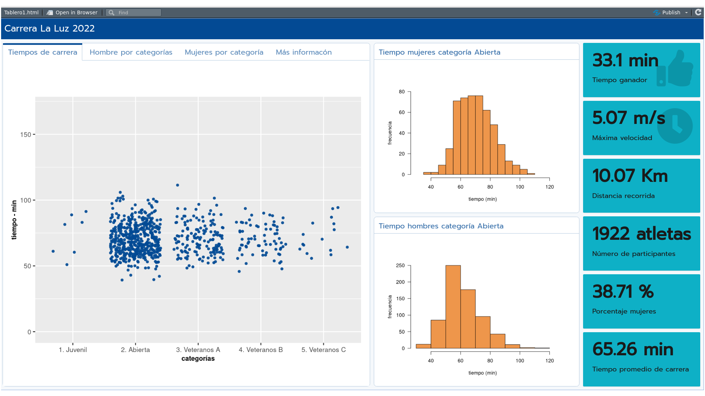
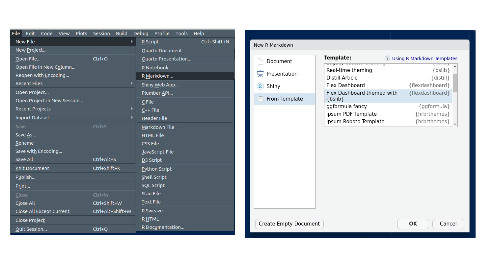
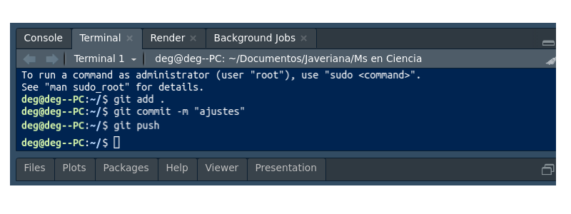

```{r setup, include=FALSE}
knitr::opts_chunk$set(echo = TRUE, comment = NA)
library(summarytools)


c1 ="#FF7F00"  # naranja - color primario 
c2 ="#034A94"  # azul oscuro - color secundario
c3 ="#0EB0C6"  # azul claro - color terciario
c4 ="#686868"  # gris - color texto
```

</br></br>

# <span style="color:#034a94">**Creación de tablero**</span> 


```{r, echo=FALSE, out.width="100%", fig.align = "center"}

```


Me diante este paquete   `flexdashboard` se pueden construir tableros en formato html que se podrán colocar en github para visualización de los resultados de una investigación o estudio de datos

</br>

Con el fin de visualizar los pasos para la construcción de un tablero se utiliza la data `CarreraLaLuz2022` contenida en `paqueteMET` y se describen los siguientes pasos utilizado el lenguaje Rmardown con algunos cambios adicionales


</br></br>

## <span style="color:#FF7F00"> **Paso 1 :**</span>

### <span style="color:#034a94">**Descargar e instalar los paquetes requeridos**</span>  

<pre>
install.packages("devtools")  # instala paquete devtools
devtools::install_github("dgonxalex80/paqueteMET") # descarga de paqueteMET
library(paqueteMET)     # activar paqueteMET

data("CarreraLuz22")    # cargar la dataset

install.packages("remotes")  
remotes::install_github("rstudio/bslib")  # descarga paquete que contiene formato    
</pre>


</br></br>

## <span style="color:#FF7F00"> **Paso 2 :**</span>

### <span style="color:#034a94">**Creación de la plantilla del tablero**</span> 

<pre>

File / New File / R Markdown...     
From Template  / Flex Dashboard themed with {bslib}

</pre>

```{r, echo=FALSE, out.width="100%", fig.align = "center"}

```

## <span style="color:#FF7F00"> **Paso 3 :**</span>

### <span style="color:#034a94">**Ajuste del formato**</span> 

El formato permite cambiar los colores que por defecto trae la plantilla y ajustarlos a una paleta especial de colores. También se puede cambiar la orientación del tablero de columnas por defecto  a filas y ajustar los títulos

* `Column {data-width=350}`: permite determinar el ancho de la columna
* `Column {data-width=700 .tabset}`: permite construir páginas adicionales
* `valueBox(value = variable,caption = "Titlo caja",icon = icono, color = código color)`: permite construir cajas con indicadores  

```{r, echo=FALSE, out.width="100%", fig.align = "center"}
knitr::include_graphics("img/tablero3.png")
```

```{r, echo=FALSE, out.width="100%", fig.align = "center"}
knitr::include_graphics("img/tablero5.png")
```

</br></br>

## <span style="color:#FF7F00"> **Paso 4 :**</span>

### <span style="color:#034a94">**Incorporación de los elementos al tablero**</span>

Se pueden agregar los gráficos en los bloque preestablecidos o crear nuevos según las necesidades y los indicadores más relevantes


```{r, echo=FALSE, out.width="100%", fig.align = "center"}

```


</br></br>

## <span style="color:#FF7F00"> **Paso 5 :**</span>

### <span style="color:#034a94">**Publicación**</span>

#### **Para su publicación es necesario** :

* Tener instalado **git** en nuestro equipo

* Tener una cuenta abierta en **GitHub**

* Crear un repositorio en **GitHib**

* Clonar el repositorio en nuestro equipo

* Crear archivo **Rmd** con formato flexdashboard (pasis 1 a 4)

* Renderizarlo el archivo con  **Kinit** (convertirlo en formato html)

* Subirlo los archivos al repositorio de GitHub 
  + `git add .`
  + `git commit -m "primer commit"`
  + `git push`
  
Estos códigos se pueden ejecutar desde la consola 

```{r, echo=FALSE, out.width="100%", fig.align = "center"}

```
  
* Publicar el tablero


